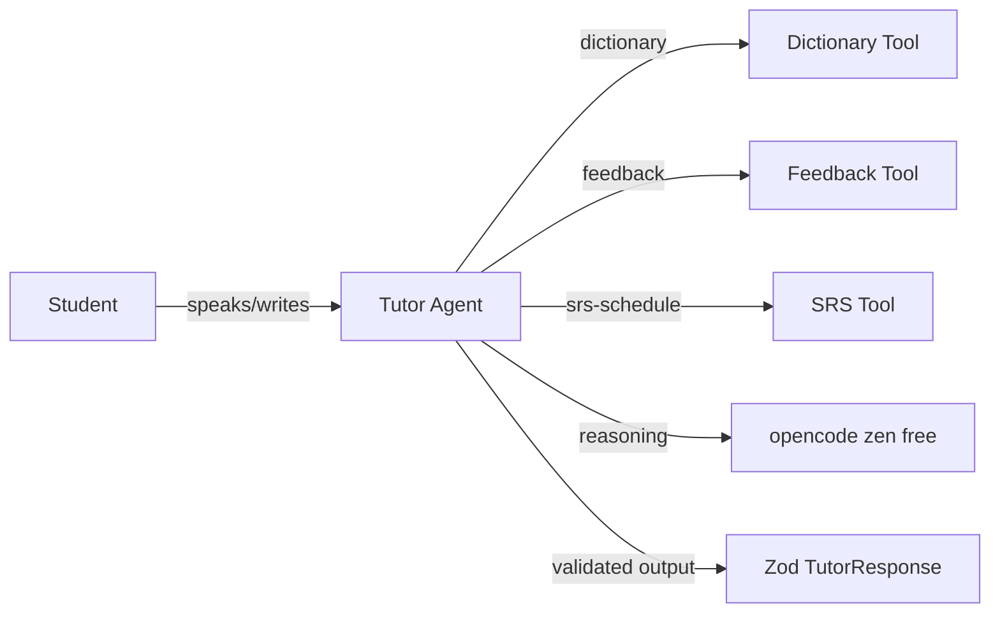

# Mastra English Tutor

> AI English tutor agent built with [Mastra](https://mastra.ai): listens, corrects grammar, plans spaced-repetition review, and evaluates its own output against ground truth.

## Why this project exists

I built this agent to explore what a **production-grade conversational AI tutor** looks like beyond the toy demo: structured corrections, spaced-repetition scheduling, a clean Mastra tool layer, and — most importantly — an **eval harness with ground truth** so model changes are measured, not guessed.

## Stack

- **Mastra** v1.60 (agent + tools) · TypeScript strict · Zod schemas
- **opencode zen** — `x-preview-f-free` via `@ai-sdk/openai-compatible` (free endpoint)
- **Vitest** (TDD, coverage thresholds) · ESLint + Prettier · GitHub Actions CI
- Commit hygiene: Husky + commitlint (Conventional Commits)

## Features

- **Tutor agent** with level/topic-aware instructions (`A1`–`B2`)
- **Structured corrections** — Zod-validated `{ reply_text, corrections[], pronunciation_score?, next_lesson }`
- **Tools**: dictionary lookup, feedback analysis (Levenshtein-based), SRS scheduling (Ebbinghaus/SM-2 intervals)
- **Evals with ground truth** — the agent is scored against expected behavior before release

## Architecture



## Quickstart

```bash
npm install
cp .env.example .env   # pega tu OPENCODE_ZEN_API_KEY
npm run test           # tests (sin red)
npm run typecheck      # strict TS
npm run evals          # evalúa el agente contra ground truth (requiere .env)
```

## Scripts

| Script                    | Description                                     |
| ------------------------- | ----------------------------------------------- |
| `npm test`                | Vitest (unit + schemas + evals helpers)         |
| `npm run test:coverage`   | Test con cobertura y thresholds                 |
| `npm run typecheck`       | TypeScript strict `--noEmit`                    |
| `npm run lint` / `format` | ESLint / Prettier                               |
| `npm run evals`           | Eval harness con ground truth (llama al modelo) |
| `npm run build`           | Compilación TS                                  |

## CI

`test → typecheck → lint → build` en GitHub Actions (`.github/workflows/ci.yml`). Todo debe pasar para mergear.

## License

MIT
